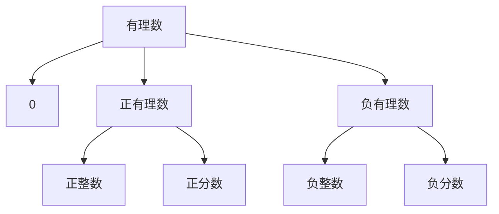
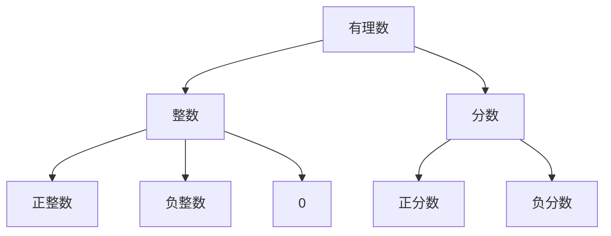
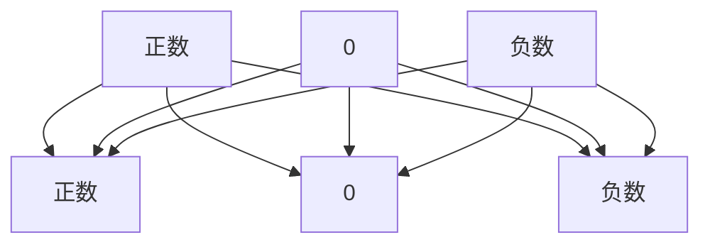

## 目录：
1. [正反数](#positive_and_negative_numbers)
1. [有理数](#rational_numbers)
1. [数轴](#number_axis)
1. [相反数](#opposite_number)
1. [绝对值](#absolute_value)
1. [有理数加法](#rational_number_addition)
1. [有理数减法](#rational_number_subtraction)
1. [有理数乘法](#rational_number_multiplication)
1. [有理数除法](#rational_number_division)
1. [有理数的乘方](#power_of_rational_number)

<span id="positive_and_negative_numbers"></span>
# 第一课：正反数
## 定义：
大于0的叫正数， 小于0的叫负数，0既不是正数也不是负数。
* 正数可以用 + 来表示。 例如：+3， +4， +5， 一般情况为了简洁 + 可以省略。
* 负数可以用 - 来表示。 例如：-3， -4， -5，负数符号不会省略。

---

## 例题：
例1:  
某年我过花生产量比上一年增长了 1.8%，油菜籽产量比上一年增长 -2.7%， “增长 -2.7%”表示什么意思？
```
答：“增长 -2.7% 表示油菜籽产量比上一年减少了 2.7%”
```
---
例2:  
一个月内，小明的体重增加 2kg， 小华体重减少 1kg， 小强体重无变化，请写出他们这个月的体重增长值。  

答：  
|小明|小华|小强|
|---|---|---|
|+2kg|-1kg|0kg|

---

## 课后题目：  
某地中午12 时气温是 7C， 过5小时气温下降了 4C， 又过期小时气温又下降了 4C， 第二天 0 时的气温是多少？  
解：12 - 4 - 4 = 4  
答：第二天 0 时的气温是 4C


---
---
---

<span id="rational_numbers"></span>
# 第二课： 有理数
## 定义：  
可以写成两个整数之比的数为有理数。  

例：  
|数字|可写成|
|:---:|:---:|
|1|1/1|
|2|2/1|
|0.33333|1/3|
|0|0/0|

整数和分数统称为有理数：  

## 分类：
1. 按照符号分类为:

 `所有分类中 0 单独分为一类，因为 0 既不是正数也不是负数。`

2. 按照定义分类为： 整数， 分数  
    * 整数分为： 正整数 负整数 和 0。  
    * 分数分为： 正分数 负分数 （分数也是小数，分为有限小数，无限小数，无限循环小数，无限不循环小数）  

`所有分类中 0 单独分为一类，因为 0 既不是正数也不是负数。`


## 例题：

例1：  
判断表中各数分便是什么数，在相应的空格中画 x

|   |正数|负数|整数|分数|有理数|
|:--:|:--:|:--:|:--:|:--:|:--:|
| -15|---| x | x |---| x |
| +6 | x |---| x |---| x |
|-3/5|---| x |---| x | x |
| 0 |---|---| x |---| x |
|2018| x |---| x |---| x |
|3又3/4|---|---|---| x | x |
| -9 |---| x |---| x | x |  

例2：  
所有正数组成正数集合，所有负数组成负数集合。 把下面的有理数填入它属于的集合圈内：  
18， -（1/9）， -5， 2/15， -（13/8），95%， -4.95， -80， 123， 3.14


`0 既不是正数也不是负数 所以不能填入上面任何的集合`

例3:  
下列说法中，其中正确的是：  
* 零是整数： &#10004; 
* 零是有理数：&#10004;
* 零是自然数：&#10004;
* 零是正数： &#10006;
* 零是负数： &#10006;
* 零是非负数：&#10004;

---
---
---

<span id="number_axis"></span>
# 第三课：数轴
## 定义：  
规定了原点、正方向、单位长度的一条直线叫做数轴  


原点：数轴的基准点， 用 0 来表示。 ---------0------------>  
正方向：原点向右侧（或者向上）为正方向，最右侧用箭头标记。 ---------->  
反方向：原点向左侧（或者向下）为副方向。  
单位长度：规定一个基准的测量单位长度并画在数轴上，之后的长度均为这个长度为基准，这个则被称为单位长度。

## 例题：  
数轴暂时在md中不支持，尽量用手画吧 =。=  

例1:  
在一条东西向的马路上，有一个汽车站牌，汽车站牌东 3m 和 7.5m处分别有一颗柳树和一棵杨树，汽车站牌西3m 和4.8m处分别有一棵槐树和一根电线杆， 画出数轴。 

例2:
在数轴上画出表示下列个数的点： 2， -1， 1/4， -1.5 

```
-2  -1.5  -1  -0.5  0   0.25  0.5  1   1.5  2  
|----|----|----|----|----|----|----|----|----|  
     *    *    *         *                   *  
```
* 表示标记的点：-1.5, -1, 1/4, 2

---
---
---

<span id="opposite_number"></span>
# 第四课：相反数
## 定义：  
代数定义：“只有”符号不同的两个数叫做：互为相反数。  
几何定义：在数轴上，位于原点两边且到原点的距离相等的两个点表示的两个数互为相反数。

## 重点：
如何在多重符号中判断最后等式中的符号?
```
当正数前的负号为奇数个时，最终结果保留一个负号，当正数前负号为偶个时最终结果不保留负号。（数字为 0 等式右侧永远为 0）

例：

-12 = -12 （等式左侧正数十二前负号为一个负号，为奇数个，等式右侧保留一个负号。）
-(-12) = 12 (两个负号为偶数个，等式右侧不保留负号)
-[-(-12)] = -12  (三个负号为奇数个，右侧保留一个)
-[+(-12)] = 12 (两个负号为偶数个，等式右侧不保留负号)
```

## 例题  
例1:  
设 a 表示一个数，则 a 的相反数如何表示？  
在数轴上把 a 和 a 的相反数表示出来。

答：  
a 的相反数是 -a  
数轴：  
```
a 是正数时：
----------|----------|----------0----------|----------|---------->
          -a                                          a

a 是负数时：
----------|----------|----------0----------|----------|---------->
          a                                          -a

a 等于 0 时：（0 和 0 互为相反数）
----------|----------|----------0----------|----------|---------->
                                a
```

例2:  
写出下列个数的相反数： 7/3, -1.5, -12, 0, n, -m  

答： -(7/3), 1.5, 12, 0, -n, m  


例3:  
-[+(-12)] 可以看做什么呢？  
```
解：  
    -[+(-12)] = -[-12]
    -[-12] = 12

答：  可以看做 12
```
---
---
---

<span id="absolute_value"></span>
# 第五课： 绝对值
## 定义：  
数轴上表示数 a 的点与原点的距离叫做数 a 的绝对值， 记作 |a|。绝对值永远是非负数 |a| >= 0。  
`当 a >= 0 时 |a| = a， 当 a <= 0 时 |a| = -a`

正数和负数的绝对值是正数，0 的绝对值是 0。  
`既： 正数的绝对值是正数本身的值， 负数的绝对值是负数本身的相反数，0 的绝对值是 0。`
每一个有理数都是由它的符号和数字本身组成的， 而数字则是他的绝对值: 
```
例：
-3 由负号和数字 3 组成,其中数字 3 就是 -3 绝对值。

同理可证：+2 的绝对值就是 2， 0 的绝对值就是 0 本身。
```

## 例题：
```
例1:

|10| = 10
|-10| = 10
|0| = 0

例2:

求下列个数的绝对值:
|-125|, |+23|, |-3.5|

答： 125， 23， 3.5
```

## 练习：
```
练习1:

写出下列数字的绝对值
6， -8， -3.9， 5/2， -(2/11), 100, 0

答： 6， 8， 3.9， 5/2， 2/11, 100, 0
```
```
练习2:

如果 |a| = 2 ，则: a = 2, 或: a = -2;
如果 |x| = |y|，则: x = y, 或: -x = y, 或: -y = x, 或: x = 0 y = 0

如果 |a| = a 求 a 和 0 的关系: 答 a >= 0
如果 |a| = -a, 求 a 和 0 的关系: 答 a <= 0
```
---
---
---

<span id="rational_number_addition"></span>
# 第五课： 有理数加法
## 定义：
```
同符号：
同符号数字相加保留符号并将数位(绝对值)相加。
例：
(+1) + (+1) = +(1 + 1); 
(-1) + (-1) = -(1 + 1) = -2;

异符号：
异符号数字相加时，结果取两个数字中较大的数字的符号，并用两个数字中较大的减去较小的。 
例：
(-2) + (+6); 因: 6 > 2 所以结果符号取 +6 的 + 号； (-2) + (+6) = +(6 - 2) = +4
(-77) + (+35); 因： 77 > 35 所以结果符号取 -77 的 - 号；(-77) + (+35) = -(77 - 35) = -38

所有数字同 0 相加都等于这个数本身。
互为相反数的数字相加结果等于 0 。
```

有理数相加的情况：  
1. 同符号相加： 正 + 正， 负 + 负
1. 异符号相加： 正 + 负， 负 + 正
1. 同 0 相加： 正 + 0， 负 + 0  

有理数加法符合一般加法法则：
```
一般加法运算律法则：
a + b = b + a
(a + b) + c = a + (b + c)

运用加法运算法则使得运算更简单!
方式：
1. 负号相同的数先相加。
2. 几个数字相加得到整数先相加。
3. 互为相反数的两个数先相加。
4. 分母相同的数先相加。
5. 整数与整数， 小数与小数相加。

例：
(-0.8) + (-2/3) + 0.8 + (-1/3) + 2/5
解: 
    = (-0.8) + 0.8 + [(-2/3) + (-1/3)] + 2/5
    = 0 + (- 3/3) + 2/5
    = (-15/15) + 6/15
    = -(15/15 - 6/15)
    = -9/15
    = -3/5
```

例如下图：

---
---
---

<span id="rational_number_subtraction"></span>
# 第六课： 有理数减法
## 定义：
减去一个数，等于加上这个数字的相反数.  
公式： a - b = a + (-b)  

大数减小数结果大于 0  
公式 a > b, a - b > 0
```
例： -3 - (-5) = 2
```

小数减大数结果小于 0  
公式 a < b, a - b < 0
```
例： -5 - (-3) = -2
```

被减数和减数相等，他们相减等于 0  
公式： a = b, a - b = 0
```
例：5 - 5 = 0, -5 - (-5) = 0
```

1. 任何数字减去 0:
    * 结果都等于这个数字本身。
    * 公式： a - (-b) = a + b
    ---
1. 任何数减去负数：
    * 减去一个负数等于加上这个负数的绝对值；
    ---
1. 正数减去正数：
    * 当减数等于被减数时，结果为 0；
    * 公式： a = b, a - b = 0
    ---
    * 当被减数大于减数时，结果符号为正号，结果为 被减数 - 减数；
    * 公式： a - b, a > b,  结果：a - b; 
    * 同理公式: a - b = a + (-b)
    ---
    * 当减数大于被减数时，结果符号为负， 结果为 减数 - 被减数 (既： 结果数字等于较大的数字减去较小的数字)；
    * 公式： a - b, b > a, 结果：-(b - a)
    * 同理公式: a - b = -(b - a)
    ---
1. 负数减去正数：
    * 结果等于负数加上这个正数的相反数
    * 公式： -a - b, b < 0, 结果 -a + (-b)
    * 同理公式：b < 0, -a - b = -a + (-b)

---
---
---
<span id="rational_number_multiplication"></span>
# 第七课： 有理数乘法
## 定义：
**两数字相乘，先看符号，符号相同，乘积结果符号为正，符号相反，乘积结果符号为负，然后将两数字的绝对值相乘写入结果。**

`口诀：正负相乘得负数，负负相乘得正数，正正相乘得正数，任何数和 0 相乘都等于 0。`

```
例1: 正正得正
3 x 5 = 15

例2: 正负得负
-3 x 5 = -15, 3 x -5 = -15

例3: 负负得正
-3 x -5 = 15

例4: 任何数和0相乘都等于 0
-3 x 0 = 0， -5 x 0 = 0
```

推导：
```
下面算式中可以看出：
每当成数减少一位，乘积则减少一个被乘数的个数。
3 x  4 = 12
3 x  3 = 9
3 x  2 = 6
3 x  1 = 3
既正正得正

因为 任何数字和 0 相乘都等于 0
3 x  0 = 0

根据上面推导法则我们继续减少乘数数量可以推导出：
3 x -1 = -3
3 x -2 = -6
3 x -3 = -9
3 x -4 = -12
即：正负得负

根据之前的算式中，当被乘数小于 0 时的算式， 以及根据 乘法交换律:a x b = b x a 的法则来看我们可以推导出：
3 x -1 = -3 x 1 乘积：-3
3 x -2 = -3 x 2 乘积：-6
3 x -3 = -3 x 3 乘积：-9
3 x -4 = -3 x 4 乘积：-12
既：负正得负

之后我们把上面的算式们上下翻转可以得到：
3 x -4 = -3 x 4 乘积：-12
3 x -3 = -3 x 3 乘积：-9
3 x -2 = -3 x 2 乘积：-6
3 x -1 = -3 x 1 乘积：-3
我们发现上面的算式中当被乘数为负数时，且被乘数不变的情况下，乘数每减少 1，乘积则增加被乘数的绝对值位个。

根据上面反转后的算式，以及上面推导出的乘积变化规律，我们可以继续将乘数依次递减，得出：
-3 x  0 = 0
-3 x -1 = 3
-3 x -2 = 6
-3 x -3 = 9
-3 x -4 = 12
即： 负负得正
```
---

**在有理数乘法中依然遵循着乘法的法则：**  
1. 乘法交换律: a x b = b x a
1. 乘法结合律: (a x b) x c = a x (b x c)
1. 乘法分配律: a x (b + c) = ab + ac
---

**有理数倒数 (Multiplicative inverse):**  
**在分数中我们知道 乘积等于 1 的两个数字互为倒数，所以`相乘等于一的两个负数也互为倒数!`**
```
例：
1 x 1 = 1 我们说 1 和 1 互为倒数。
3 x 1/3 = 1 我们说 3 和 1/3 互为倒数。

-1 x -1 = 1 我们说 -1 和 -1 互为倒数。
-3 x -(1/3) = 1 我们说 -3 和 -(1/3) 互为倒数。

由此我们可以看出负数的倒数是负数，正数的倒数是正数！
```

**在有理数相乘时我们来观察算式中负因数的个数，如果负因数个数是偶数，那么乘积为正数，反之如果负因数个数是奇数，那么乘积为负数。**  
**既：奇负偶正**
```
例：
2 x 3 x 4 x (-5) = -120,            奇数个负数， 乘积为负数
2 x 3 x (-4) x (-5) = 120           偶数个负数， 乘积为正数
2 x (-3) x (-4) x (-5) = -120       奇数个负数， 乘积为负数
(-2) x (-3) x (-4) x (-5) = 120     偶数个负数， 乘积为正数
```
---
---
---
<span id="rational_number_division"></span>
# 第八课： 有理数除法
## 定义：
**两数相除，同号得正，异号得负，并把绝对值相除，0 除以任何不等于 0 的数字都得 0。**  
```
公式: 
1. -a / b = a / -b = - (a / b) 异号相除，商等于负
2. -a / -b = a / b             同号相除，商等于正
```

**延伸：**  
**除以一个不等于零的数，等于乘以这个数的倒数。一般用在不能整除时。**  
`公式： a / b = a x 1/b b != 0`


**论证:**
```
求： -15 / 3 = X
解：
-15 = 3 x X
X = -5

因为 X = -5 可得 -15 x 1/3 = -5

根据上述算式可以得出
-15 / 3 = -15 x 1/3
3 和 1/3 互为倒数

结论: 除以一个数字等于乘以这个数字的倒数
```
---
---
---
<span id="power_of_rational_number"></span>
# 第九课： 有理数的乘方
## 定义：
**求 n 个相同因数的积的运算，叫做乘方，乘方的结果叫做幂。**  
既：a x a x ...(n) a = a<sup>n</sup>, a 读作底数， n 读作指数， 结果读作幂。

例：  
a x a x a 记做 a<sup>3</sup>

法则:
```
正数乘方：
符号: 正号
幂：  幂等于指数个底数相乘 a x a x a...(n)

负数的乘方:
符号: 如果指数是偶数个则符号为 + 如果指数为奇数个，则符号为负。
幂：  幂的绝对值等于指数个底数相乘 |a x a x a...(n)|。

分数的乘方：
符号: 如果指数是偶数个则符号为 + 如果指数为奇数个，则符号为负。
幂：  幂的绝对值等于分数的，分子、分母，分别做正数乘方的绝对值。
```

---

书写：  
如果有符号，则需要将数字的符号和数字括起来, 特别是负数和分数:   

### (-2)<sup>3</sup>, (-<sup>2</sup>&frasl;<sub>5</sub>)<sup>5</sup>, (<sup>2</sup>&frasl;<sub>3</sub>)<sup>4</sup>  
*`正数符号一般可以省略。正整数不需要括起来。`*

---

**注意！**  
(-3)<sup>4</sup> 和 -3<sup>4</sup> 表达的意思不一样！  
第一个表达：-3 的 4 次方。  
第二个表达：负的 3 的 4次方，即 3 的 4 次方的相反数。

同理在分数中如果分数没有被括号括起来， 而分子上有指数, 则这个指数是分子的乘方而不是整个分数的乘方！  

例：  

<math style="font-size:30px">
  <msup>
    <mfrac>
      <mn style="font-size:30px">3</mn>
      <mn style="font-size:30px">2</mn>
    </mfrac>
    <mn style="font-size:12px">2</mn>
  </msup>
</math>
=
<math style="font-size:30px">
  <msup>
    <mfrac>
      <mn style="font-size:30px">3 x 3 x 3</mn>
      <mn style="font-size:30px">2</mn>
    </mfrac>
  </msup>
</math>
<br>
<br>

这个分数的指数表示的是：  2 分之 3，分子 3 的 3 次方！ 而不是 2 分之 3 的三次方！

分数整体乘方应该表达为:
<math style="font-size:30px">
  <msup>
    <mrow>
      <mo>(</mo>
      <mfrac>
        <mrow>
          <mn style="font-size:24px">分子</mn>
        </mrow>
        <mrow>
          <mn style="font-size:24px">分母</mn>
        </mrow>
      </mfrac>
      <mo>)</mo>
    </mrow>
    <mn style="font-size:12px">指数</mn>
  </msup>
</math>

---